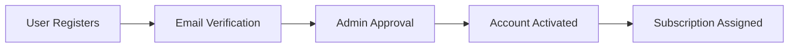
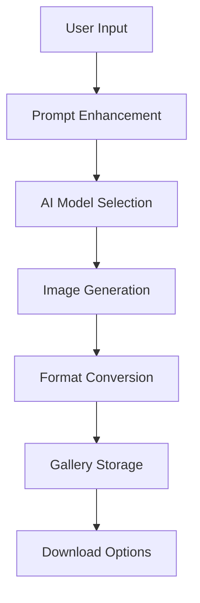
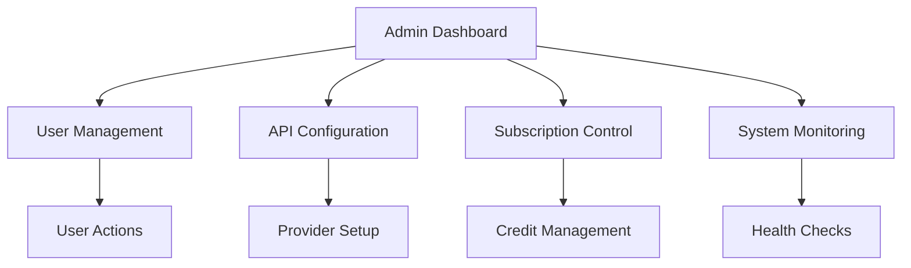

# 📖 SketchMaker AI - Product Overview

## 🎯 What is SketchMaker AI?

**SketchMaker AI** is a comprehensive, enterprise-grade AI-powered image generation platform that provides users with advanced tools to create stunning visuals using cutting-edge artificial intelligence models. Built with Flask and designed for scalability, it offers a complete solution for AI image generation with multi-provider support, user management, and administrative controls.

## 🌟 Key Highlights

### 🎨 **Multi-Provider AI Integration**
- **OpenAI DALL-E** - Industry-leading image generation
- **Anthropic Claude** - Advanced prompt understanding  
- **Google Gemini** - Versatile multimodal AI
- **Groq** - High-performance inference
- **Fal.ai Models** - Specialized models (Flux, LoRA, Realism)

### 🚀 **Advanced Features**
- **Intelligent Prompt Enhancement** - AI-powered prompt optimization
- **Custom LoRA Training** - Train personalized AI models
- **Banner & Logo Generation** - Specialized tools for branding
- **Multi-Format Export** - WEBP, PNG, JPEG support
- **Batch Processing** - Generate multiple variations
- **Real-time Preview** - Instant feedback and adjustments

### 👥 **Enterprise Management**
- **Role-Based Access Control** - Admin, User, Superadmin roles
- **Subscription Management** - Flexible credit-based system
- **User Administration** - Complete user lifecycle management
- **Email Integration** - Automated notifications and workflows
- **Audit Logging** - Track all system activities

### 🔒 **Security & Compliance**
- **CSRF Protection** - Comprehensive security measures
- **Secure Authentication** - Multiple authentication methods
- **API Key Management** - Centralized credential management
- **Rate Limiting** - Prevent abuse and ensure fair usage
- **Data Privacy** - User data protection and privacy controls

## 🏗️ System Architecture

### **Frontend Components**
- **Modern Web Interface** - Responsive design with DaisyUI
- **Real-time Updates** - Dynamic content loading
- **Mobile Responsive** - Works on all screen sizes
- **Dark/Light Theme** - User preference support

### **Backend Services**
- **Flask Application** - Python-based web framework
- **SQLAlchemy ORM** - Database abstraction layer
- **APScheduler** - Background job processing
- **Email Service** - SMTP integration for notifications
- **File Management** - Secure upload and storage

### **AI Integration Layer**
- **Multi-Provider Support** - Seamless AI model switching
- **Prompt Processing** - Advanced prompt enhancement
- **Model Management** - Dynamic model configuration
- **Error Handling** - Robust error recovery

## 🎯 Target Users

### **Content Creators**
- Marketing teams creating visual content
- Social media managers needing quick graphics
- Bloggers and writers requiring illustrations
- E-commerce businesses generating product visuals

### **Developers & Agencies**
- Development teams integrating AI capabilities
- Design agencies offering AI-powered services
- SaaS companies adding image generation features
- Enterprises automating visual content creation

### **Administrators**
- IT teams managing enterprise AI tools
- System administrators controlling user access
- Compliance officers ensuring security standards
- Business leaders tracking usage and costs

## 💼 Use Cases

### **Marketing & Branding**
- **Social Media Content** - Instagram posts, Twitter headers
- **Marketing Materials** - Banners, advertisements, flyers
- **Brand Assets** - Logos, icons, brand illustrations
- **Website Graphics** - Hero images, backgrounds, icons

### **E-commerce & Product**
- **Product Mockups** - Lifestyle and product shots
- **Category Images** - Visual category representations
- **Promotional Graphics** - Sale banners, featured products
- **User-Generated Content** - Customer story illustrations

### **Content & Publishing**
- **Blog Illustrations** - Article headers, inline graphics
- **Book Covers** - Novel and non-fiction covers
- **Educational Content** - Diagrams, explanatory visuals
- **Newsletter Graphics** - Email header images

### **Custom Applications**
- **Training Data** - Generate datasets for ML models
- **Prototype Visuals** - Rapid visual prototyping
- **A/B Testing** - Multiple creative variations
- **Personalization** - User-specific visual content

## 🔄 Workflow Overview

### **1. User Registration & Setup**

### **2. Image Generation Process**

### **3. Admin Management Flow**

## 📊 System Capabilities

### **Performance Metrics**
- **Concurrent Users**: Scales based on infrastructure
- **Image Generation**: Multiple simultaneous requests
- **Response Time**: < 30 seconds for most models
- **Uptime**: 99.9% availability target
- **Storage**: Unlimited with proper configuration

### **Supported Formats**
- **Input**: Text prompts, configuration parameters
- **Output**: WEBP, PNG, JPEG formats
- **Sizes**: From 512x512 to 1920x1080
- **Batch**: Up to 4 variations per request

### **Integration Capabilities**
- **REST API** - Complete programmatic access
- **Webhook Support** - Real-time notifications
- **Export Options** - Direct download, gallery storage
- **Custom Models** - LoRA training and deployment

## 🎭 Product Editions

### **Community Edition**
- Basic image generation
- Limited AI providers
- Standard user management
- Community support

### **Professional Edition** 
- All AI providers enabled
- Advanced admin features
- Priority support
- Custom branding options

### **Enterprise Edition**
- Full feature access
- Custom integrations
- Dedicated support
- SLA guarantees
- On-premise deployment

---

*This overview covers SketchMaker AI v1.0.0.0 (Genesis). Features and capabilities may vary by edition and configuration.*